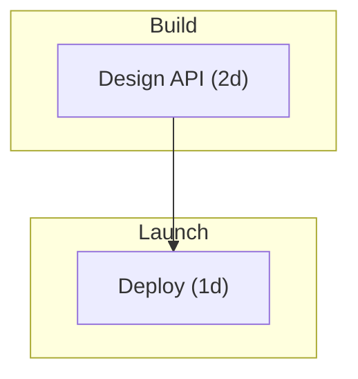

# ORBIT delivery

```mermaid
flowchart TD
    subgraph phase_1["Build"]
        task_1_Design_API["Design API (2d)"]
    end
    subgraph phase_2["Launch"]
        task_2_Deploy["Deploy (1d)"]
    end
    task_1_Design_API --> task_2_Deploy
```
